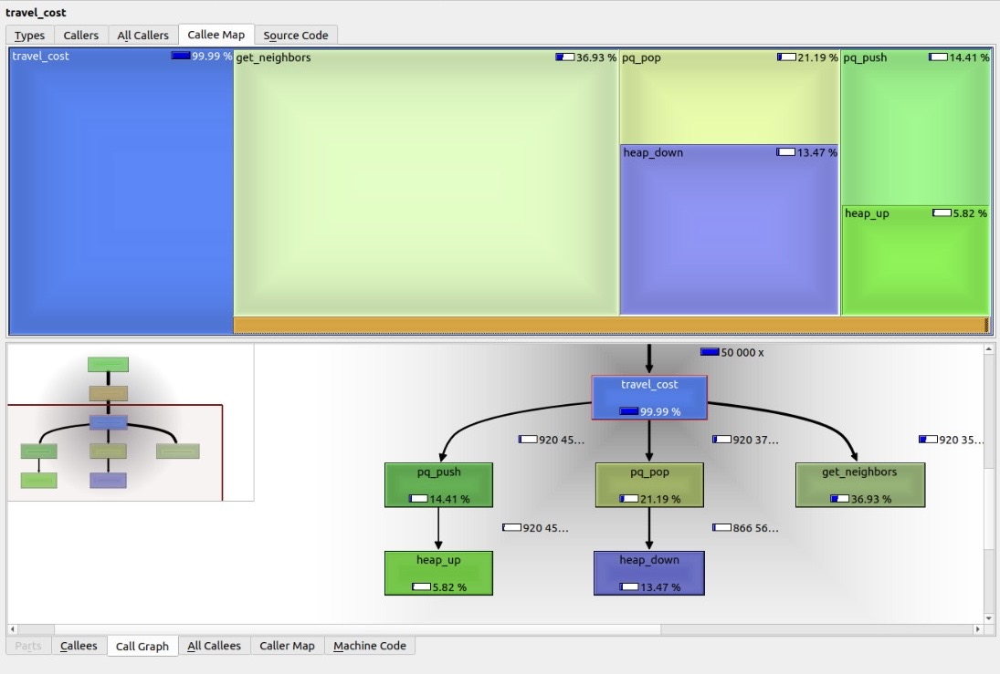

# MovHex

A C project developed for the Algorithms and Data Structures course at
Politecnico di Milano in the 2024/2025 academic year. It computes minimum travel costs on a hexagonal map
with traversal costs and directed air routes.

This repository contains the university project and its regression tests.
The program reads commands from standard input and writes responses to
standard output.

## Build and run

A C compiler (GCC or Clang) and Make are required. Python 3 is only needed
for the tests. On Linux and macOS:

```sh
make
./movhex < tests/example.txt
```

To compile directly:

```sh
cc -O2 -std=gnu11 -Wall -Wextra movhex.c -lm -o movhex
```

## Commands

Coordinates are zero-based: `x` is the column and `y` is the row.

| Command | Description |
| --- | --- |
| `init columns rows` | Creates or resets the map, setting every cell's initial cost to 1. |
| `change_cost x y change radius` | Updates cell costs and outgoing air route costs within the radius. The change must be between −10 and 10, and the radius must be positive. |
| `toggle_air_route x1 y1 x2 y2` | Adds or removes a directed air route. Each cell supports up to five outgoing air routes. |
| `travel_cost x1 y1 x2 y2` | Returns the minimum travel cost, or `-1` if the coordinates are invalid or the destination is unreachable. |

Commands that modify the map return `OK` or `KO`. Costs are clamped to the
range 0–100. A cell with a cost of zero cannot be departed from; the
destination cell's cost is not charged on arrival.

```text
init 3 3
travel_cost 0 0 2 0
toggle_air_route 0 0 2 0
travel_cost 0 0 2 0
```

Output:

```text
OK
2
OK
1
```

## Algorithm

The grid uses offset coordinates with odd rows shifted. Cells are graph
vertices with up to six ground neighbors and five outgoing air routes.
Minimum travel costs are computed using Dijkstra's algorithm and a priority
queue backed by a binary heap. A hash table caches query results; changes
to the map invalidate the cache.

## Profiling

During development, I used Valgrind's Callgrind tool and KCachegrind to inspect
instruction costs and identify hotspots in the shortest-path implementation.
The profile below highlights neighbor traversal and priority queue operations
within `travel_cost`.



*Development-time profile, showing instruction costs for a specific workload.*

## Tests

```sh
make test       # compare program output against the expected results
make sanitize   # run tests with AddressSanitizer and UndefinedBehaviorSanitizer
make clean      # remove generated executables
```

`tests/` contains seven cases from the original project and an additional
regression test for air route removal and reinsertion, and map
reinitialization. The `.txt.result` files contain the expected output.
CI runs the tests on Linux and macOS.

Repository cleanup also fixed cache invalidation when removing an air route,
air route array capacity after removal, and cache deallocation when resetting
the map. The project retains its original structure and assumes input follows
the assignment's format; its parser is not designed for arbitrary input.
